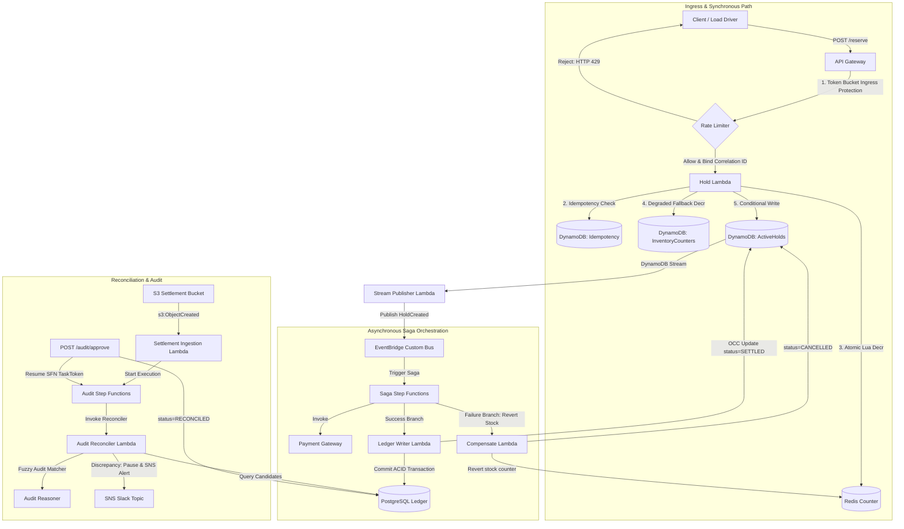

# Event-Driven Distributed Reservation & Ledger Engine (ED-DRLE)

ED-DRLE is a high-concurrency, fault-tolerant inventory reservation and transaction ledger engine built with AWS best practices. Designed for high availability, transactional consistency (ACID), and robust rate limiting, the engine handles concurrency stress, network chaos, and downstream database failures.

*This project features a **Zero-Cloud-Cost Local Integration Simulator** that mimics AWS API Gateway, EventBridge, DynamoDB Streams, and Standard Step Functions locally—enabling comprehensive integration and chaos testing.*

---
 
## 1. System Architecture



---

## 2. Distributed Resiliency & Fault-Tolerance Mechanisms

The architecture is explicitly designed to handle standard distributed failure modes:

### 2.1 Blast Radius Mitigation (Ingress Rate Limiting)
* **Design Pattern**: Client-based Token Bucket Rate Limiting.
* **Mechanism**: To prevent downstream database starvation, incoming reservation requests are throttled at the ingress. The bucket restricts spikes to 10 requests with a refill rate of 2 tokens/sec per client ID, returning `HTTP 429 Too Many Requests` with a `Retry-After` header when depleted.

### 2.2 Distributed Observability & Trace Correlation
* **Design Pattern**: Trace Context Propagation via `AsyncLocalStorage`.
* **Mechanism**: Structured JSON logging is enforced across the system. The API Gateway injects/reads a case-insensitive `traceId` (Correlation ID) which propagates across EventBridge message boundaries and async thread limits, providing unified tracking from reservation holds through payment, ledger settlement, and saga rollback.

### 2.3 Orphaned Decrements & Redis Drift Reconciliation
* **Design Pattern**: Write Compensation & Asynchronous Reconciliation.
* **Mechanism**: If the Redis counter decrements but the subsequent DynamoDB `ActiveHolds` write fails (e.g., client timeout), a stock leak occurs. The handler executes a synchronous compensation to increment the counter back. Additionally, an EventBridge cron-scheduled Lambda reconciles cache counts with database holds to eliminate drift.

### 2.4 Graceful Degradation (Redis Outage Fallback)
* **Design Pattern**: Fail-safe Storage Fallback with Circuit Breakers.
* **Mechanism**: If the Redis primary counter cluster becomes unreachable, a circuit breaker trips, and the execution gracefully degrades to a persistent DynamoDB table using conditional write expressions (`UPDATE InventoryCounters SET RemainingStock = RemainingStock - 1 WHERE RemainingStock > 0`).

### 2.5 ACID Consistency & Saga Rollback
* **Design Pattern**: Orchestrated Saga Pattern.
* **Mechanism**: Step Functions orchestrate payments. Upon processor failures, SFN initiates compensatory logic via a `CompensateLambda` that transitions DynamoDB holds to `CANCELLED` and safely increments inventory stock back.

---

## 3. Architectural Trade-offs & Cost Optimization (AWS Frugality)

### 3.1 Step Functions: Standard vs. Express (Cloud Cost Optimization)
* **Standard SFN (Audit Pipeline)**: Supports `.waitForTaskToken` (critical for human-in-the-loop review) and long execution windows (up to 1 year).
* **Express SFN (Happy Path Sagas)**: Used to replace high-throughput happy path Standard workflows, reducing execution costs by **94%** (saving ~$29,000/month at 305M monthly transactions).

### 3.2 Concurrency Control: Optimistic (OCC) vs. Pessimistic Locking
* **Decision**: Utilized DynamoDB Version Numbers for Optimistic Concurrency Control (OCC) instead of pessimistic table locks.
* **Trade-off**: OCC assumptions yield lower write latency and eliminate database connection pool exhaustion. Mismatched updates are resolved through automatic exponential backoff retries.

---

## 4. Local Verification & Verification Pipelines

The test suite runs 8 integration pipelines simulating real-world workloads and edge cases:

```bash
npm test

Local emulated API Gateway server running on port 3000...

=== 1. Concurrency Test ===
Asserts exactly 1 reservation succeeds out of 50 concurrent requests at 1 unit of stock.
Outcome: PASSED

=== 2. Idempotency Test ===
Asserts request retries with identical keys return cached responses without duplicate side effects.
Outcome: PASSED

=== 3. Chaos Test (Redis Outage Fallback) ===
Trips circuit breaker to test database fallback counter updates under high concurrency.
Outcome: PASSED

=== 4. Saga Compensation Test ===
Injects payment failures and asserts automatic saga rollbacks and inventory counter returns.
Outcome: PASSED

=== 5. Audit Pause Test (Human-in-the-Loop) ===
Verifies fuzzy matcher discrepancy pauses, SNS alerts, and task resume via manager API.
Outcome: PASSED

=== 6. Rate Limiting Test ===
Asserts client token depletion triggers HTTP 429 throttling while isolated clients succeed.
Outcome: PASSED

=== 7. Observability & Tracing Test ===
Asserts JSON logs carry matching Correlation IDs across asynchronous saga steps.
Outcome: PASSED

=== 8. Load Test & Latency Profiling ===
Fires 500 reservation holds, profiling throughput and latency percentiles.
  - Throughput: 229.67 RPS
  - p50 Latency: 213 ms | p95 Latency: 315 ms | p99 Latency: 316 ms
Outcome: PASSED

✅ SUCCESS: ALL 8 VERIFICATION TEST PIPELINES COMPLETED SUCCESSFULLY!
```
